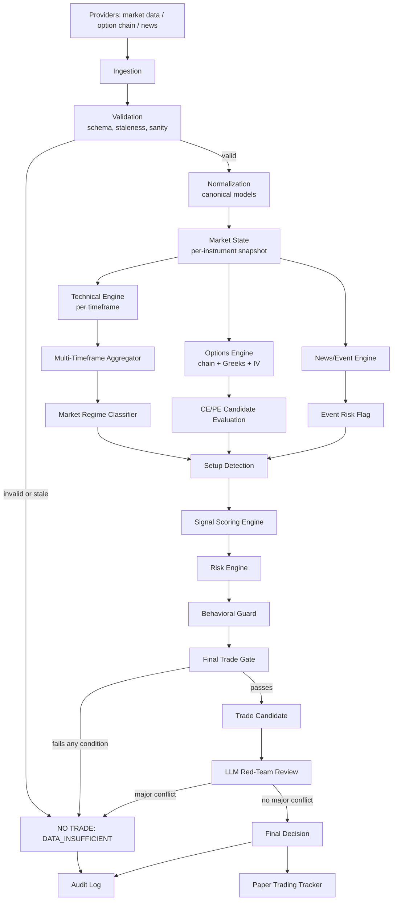

# TIRE — Phase 0 Architecture

Status: **APPROVED WITH REQUIRED CHANGES — 2026-08-27**. See [Addendum](#addendum--approved-review-changes-2026-08-27) at the end of this document, which supersedes §8 (Provider Abstraction), §16 (LLM Architecture), §17 (Scheduler Architecture), §18 (Final Trade Gate), and §26 (Development Phases) below. Sections not named in the addendum stand as originally written.
Scope: Architecture only. No trading logic, no broker execution, no order authority anywhere in this design.

Related documents:
- [`docs/data-sources/PROVIDERS.md`](../data-sources/PROVIDERS.md) — data source classification, provider abstraction detail
- [`docs/risk/RISK_AND_BEHAVIOR.md`](../risk/RISK_AND_BEHAVIOR.md) — risk engine rules, behavioral guard rules

---

## 1. Workspace Audit

| Item | State |
|---|---|
| `app/` | Empty package skeleton only (`__init__.py` files, no logic). Folder layout already anticipates: `data/{providers,ingestion,validation,normalization}`, `domain/{market,technical,options,signals,risk,news}`, `engines`, `llm/prompts`, `orchestration`, `audit`, `api/routes`, `config`, `utils`. |
| `README.md` | Already states the correct safety posture and a compressed version of the intended pipeline. |
| `pyproject.toml` | Deps already chosen: FastAPI, Pydantic v2, SQLAlchemy+asyncpg, Redis, APScheduler, httpx, pandas/numpy, pytest/ruff/mypy(strict). No LLM SDKs pinned yet (correct — deferred to LLM abstraction design). |
| `.env.example` | Already has DB/Redis/LLM/provider/risk/scheduler placeholders, `BROKER_ORDER_EXECUTION_ENABLED=false`, `MAX_RISK_PER_TRADE=0` etc. as zeroed-out safe defaults. |
| `SAFETY_LOCK.txt` | Codifies the Phase-1 execution lock and preconditions for ever lifting it. Treat as a standing constraint on all future work, not just documentation. |
| `docs/{architecture,data-sources,operations,risk,strategies}` | Empty — this response populates `architecture/`, `data-sources/`, `risk/`. `operations/` and `strategies/` intentionally left for later phases (runbooks and strategy definitions don't exist yet because no engine exists yet). |
| `migrations/`, `scripts/`, `tests/**` | Empty. No schema, no code, nothing to test yet. |
| Git | Not initialized. |

**Conclusion:** nothing needs to be preserved carefully or worked around — the skeleton is a correct but empty forecast of the architecture below. This design fills it in; it does not replace it.

**Gaps in the existing skeleton** (folders that need to be added, not just filled):
`app/domain/regime/`, `app/domain/behavior/`, `app/scheduler/`, `app/replay/`, `app/paper_trading/`, `app/gate/`, `app/persistence/` (DB models/session — SQLAlchemy is a dependency but has no home yet).

---

## 2. Non-Negotiable Principles (recap, binding on every module below)

1. The LLM is never the source of numeric market truth. It only ever reasons over data already computed deterministically.
2. Every deterministic stage output is a typed, validated, serializable object — no raw dicts crossing module boundaries.
3. Default state on any ambiguity, missing data, staleness, or component failure is **NO TRADE**, never a fallback "best guess" direction.
4. The risk engine and trade gate are pure functions of validated data + config. The LLM cannot alter their inputs or override their output.
5. Every analysis cycle is fully reproducible from stored data — no step reads live/mutable state that isn't snapshotted.
6. Order execution code does not exist in Phase 1. `BROKER_ORDER_EXECUTION_ENABLED` is a documented intent flag, not a feature to wire up yet.

---

## 3. High-Level Data Flow



Every arrow is a typed contract (Pydantic models), not a shared mutable object. Every box left of "Final Trade Gate" is deterministic Python with unit tests; only "LLM Red-Team Review" calls a model.

---

## 4. Proposed Folder Structure

Additions marked **NEW**; everything else already exists as an empty stub and gets filled in place.

```
app/
  config/                  # Settings, market calendar, risk limit config (pydantic-settings)
  api/
    routes/                # Read-only FastAPI endpoints (view runs/decisions). No execution routes.
  data/
    providers/             # One adapter per external source, behind a common Protocol
    ingestion/              # Scheduled collectors calling providers, writing raw snapshots
    validation/             # Schema + staleness + sanity checks, circuit breaker state
    normalization/           # Raw provider payload -> canonical domain models
  domain/                  # Pure, stateless, deterministic calculation libraries (no I/O, no DB)
    market/                  # OHLCV/LTP/index models, market-state assembly
    technical/               # Indicators, S/R, breakout/breakdown, MTF alignment rules
    options/                 # Option chain math: OI, PCR, max pain, IV, Greeks, liquidity checks
    news/                    # Classification, dedup, relevance/sentiment scoring
    signals/                 # Evidence categories, scoring, conflict detection
    risk/                    # R:R, position sizing, exposure/loss-limit rules
    regime/                  # NEW — market regime classification (trend/vol regime)
    behavior/                # NEW — personal trading-mistake detectors
  engines/                 # Stateful orchestrators combining domain outputs per pipeline stage
    setup_detection.py
    signal_engine.py
    risk_engine.py
    trade_gate.py           # NEW-ish (folder existed, file doesn't) — the deterministic AND-gate
  llm/
    provider_client.py       # Provider-agnostic interface (Ollama/Anthropic/OpenAI/Google)
    prompts/                 # Versioned prompt templates
    schemas.py                # Structured input/output contracts for LLM calls
    red_team.py               # Adversarial reviewer using provider_client
  scheduler/                # NEW — NSE-calendar-aware cycle scheduler (wraps APScheduler)
  replay/                   # NEW — historical replay runner (same pipeline, historical inputs)
  paper_trading/            # NEW — hypothetical entry/SL/target/exit tracking
  gate/                     # (optional alias; see note below — may fold into engines/trade_gate.py)
  persistence/              # NEW — SQLAlchemy models, session/repository layer
  orchestration/            # Top-level pipeline DAG runner: wires data->...->audit per cycle
  audit/                    # analysis_run_id issuance, snapshot serialization, audit event writer
  utils/                    # Timezone/market-calendar helpers, retry/backoff, ids
docs/
  architecture/             # this document
  data-sources/             # provider classification (below)
  risk/                     # risk + behavior rule reference (below)
  operations/               # (Phase 2+) runbooks, on-call, incident playbooks
  strategies/                # (Phase 2+) strategy/setup definitions once signal engine is validated
migrations/                 # Alembic migrations (created when persistence/ lands, not before)
scripts/                    # One-off ops scripts (backfill, provider health check) — created on demand
tests/
  unit/{technical,options,signals,risk,regime,behavior,...}
  integration/{data,llm,pipeline}
  safety/                   # trade-gate and safety-lock invariant tests
```

**Note on `engines/` vs `domain/` vs `orchestration/`** — this distinction is load-bearing and easy to blur, so it's explicit:
- `domain/*` — pure functions/classes, no I/O, no DB, no time-dependence beyond passed-in timestamps. 100% unit-testable with fixtures.
- `engines/*` — combine one or more `domain` outputs into a single pipeline-stage result (e.g. `signal_engine.py` takes technical+options+news+regime domain outputs and produces a `SignalScore`). Still no I/O.
- `orchestration/` — the only layer that knows about the *sequence* of stages, calls `data/`, `persistence/`, `audit/`, and `llm/`, and owns the per-cycle `analysis_run_id`. This is what the scheduler invokes.

`gate/` is likely unnecessary as a top-level package — the final trade gate is one more `engines/trade_gate.py` module. Listed here only because it was implied by the brief; recommend folding it into `engines/` unless review prefers it stand alone for visibility.

---

## 5. Module Responsibilities (one line each)

| Module | Responsibility |
|---|---|
| `data/providers/*` | Speak to exactly one external source; return raw, provider-shaped payloads; report health/latency. |
| `data/ingestion` | Scheduled pulls; writes raw snapshots + `provider_health` rows; never transforms. |
| `data/validation` | Schema check, staleness check (per data type — see failure matrix), duplicate detection, cross-provider sanity check where a secondary source exists. |
| `data/normalization` | Raw → canonical `domain` models. Only place that knows provider-specific field names. |
| `domain/market` | Assembles `MarketState` (instrument, OHLCV series, LTP, VWAP, breadth) from normalized data. |
| `domain/technical` | Indicator math + structure/breakout/reversal detection, all strictly single-timeframe (one instrument, one timeframe, one `as_of` per call). Never combines or compares across timeframes. |
| `domain/options` | Option chain math (OI/PCR/max pain/IV/Greeks), liquidity/spread checks, expiry-distance and moneyness classification. |
| `domain/news` | Classify, dedupe, score relevance/sentiment of ingested news; flags event-risk windows. |
| `domain/regime` | Classifies higher-timeframe market regime (trending/ranging, high/low volatility). |
| `domain/signals` | Evidence-category scoring primitives + conflict detection primitives (used by `engines/signal_engine.py`). |
| `domain/risk` | R:R math, position sizing formula, exposure/loss-limit checks (pure functions of inputs + config). |
| `domain/behavior` | Detectors for each historical-mistake pattern (see `RISK_AND_BEHAVIOR.md`). |
| `engines/setup_detection.py` | The only place that combines multiple timeframes' `domain/technical` output — this is where MTF alignment classification (§10: `FULL_ALIGNMENT`/`PARTIAL_ALIGNMENT`/`CONFLICT`/`REGIME_UNCLEAR`) happens — plus options + regime, to produce candidate `Setup` objects (bullish/bearish/none). |
| `engines/signal_engine.py` | Runs all evidence categories, produces `SignalScore` with positive/negative/missing/conflicting evidence lists. |
| `engines/risk_engine.py` | Turns a `Setup` + `SignalScore` + account/risk config into a `RiskAssessment` (or hard reject). |
| `engines/trade_gate.py` | The deterministic AND-gate; only output types are `TradeCandidate` or `NoTrade(reason)`. |
| `llm/*` | Structured red-team review of a `TradeCandidate`; never called before the gate. |
| `scheduler/` | Knows NSE market hours/holidays/expiry days; decides *whether* a cycle should run at all. |
| `orchestration/` | Runs one full cycle end-to-end, owns `analysis_run_id`, calls audit at every stage. |
| `replay/` | Re-runs `orchestration` against historical snapshots with a fixed "as-of" clock; forbids look-ahead. |
| `paper_trading/` | Tracks hypothetical fills/exits from `TradeCandidate`s that pass the gate; computes realized/unrealized stats. |
| `persistence/` | SQLAlchemy models + repositories; the only layer that talks to Postgres. |
| `audit/` | Serializes every stage's input/output for a run; the source of truth for "what did the system know at 10:35". |
| `api/routes` | Read-only views: list runs, view a decision + its full evidence trail, provider health, paper-trading stats. |

---

## 6. Dependency Graph (layering rules — enforced by import direction, checked in CI later)

```
utils, config
   ^
   |
persistence  <---  audit
   ^                 ^
   |                 |
data/providers -> data/ingestion -> data/validation -> data/normalization
                                                             |
                                                             v
                                                     domain/market
                                                             |
        +--------------+--------------+--------------+------+
        v              v              v              v
   domain/technical domain/options domain/news   domain/regime
        |              |              |              |
        +------ engines/setup_detection <------------+
                        |
                domain/signals -> engines/signal_engine
                        |
                domain/risk -> engines/risk_engine
                        |
                domain/behavior -> (feeds engines/risk_engine + trade_gate)
                        |
                engines/trade_gate
                        |
                    llm/red_team
                        |
                orchestration (wires all of the above; only caller of scheduler)
                        |
              replay/  paper_trading/  api/routes
```

Rule: nothing in `domain/*` may import from `data/*`, `persistence/*`, `llm/*`, or `orchestration/*`. This is what keeps `domain/*` unit-testable with plain fixtures and keeps the LLM structurally incapable of feeding back into the calculation layer.

---

## 7. Database Entity Design

All entities below are additive to `persistence/models.py`; migrations generated via Alembic once the module lands (not created now, per instruction).

| Entity | Key fields (indicative) | Purpose | Retention |
|---|---|---|---|
| `instruments` | symbol, exchange, segment (EQ/FUT/OPT), lot_size, tick_size | Static reference data | Indefinite |
| `option_contracts` | instrument_id, underlying, expiry, strike, right(CE/PE) | Static reference data | Indefinite |
| `candles` | instrument_id, timeframe, ts, o,h,l,c,v, provider, ingested_at | Raw+normalized OHLCV | Indefinite (partitioned by month) |
| `market_data` | instrument_id, ts, ltp, prev_close, vwap, provider, ingested_at | Tick/quote-level snapshots | 90 days hot, archive after |
| `option_chain_snapshots` | underlying, expiry, ts, strike window JSON (OI/ΔOI/vol/IV per strike), pcr, max_pain | Full chain at a point in time | 90 days hot, archive after |
| `technical_snapshots` | instrument_id, timeframe, analysis_run_id, indicator values JSON, structure classification | One per timeframe per run | Tied to analysis_run retention |
| `market_regimes` | analysis_run_id, timeframe, regime label, confidence | Regime classifier output | Tied to analysis_run retention |
| `news_events` | ts, source, headline, entity, category, sentiment, confidence, dedup_hash | Ingested news | 1 year |
| `signals` | analysis_run_id, evidence JSON (positive/negative/missing/conflicting), score | Signal engine output | Tied to analysis_run retention |
| `risk_assessments` | analysis_run_id, entry/invalidation/targets, R:R, position size, limit checks JSON | Risk engine output | Tied to analysis_run retention |
| `behavioral_warnings` | analysis_run_id, pattern, severity, evidence | Behavior guard output | Tied to analysis_run retention |
| `trade_candidates` | analysis_run_id, direction(CE/PE/NONE), gate result, gate reasons JSON | Trade gate output | Indefinite |
| `llm_analyses` | analysis_run_id, prompt_version, provider, model, request JSON, response JSON, latency | Red-team call record | Indefinite (needed for audit) |
| `analysis_runs` | run_id (PK, UUID), started_at, mode(realtime/replay/paper), status, final_decision | One row per 5-min cycle | Indefinite |
| `paper_trades` | trade_candidate_id, entry, sl, target, status, exit_ts, exit_reason, pnl | Hypothetical trade tracking | Indefinite |
| `audit_events` | analysis_run_id, stage, payload JSON, ts | Full replayable trail | Indefinite (this *is* the audit log) |
| `provider_health` | provider, ts, status, latency_ms, error | Health/observability | 30 days |

Indexing: every `*_run_id` FK indexed; `candles`/`market_data`/`option_chain_snapshots` indexed on `(instrument_id, ts)`; `analysis_runs.started_at` indexed for time-range queries used by replay.

---

## 8. Provider Abstraction (summary)

Full classification and per-provider evaluation criteria in [`docs/data-sources/PROVIDERS.md`](../data-sources/PROVIDERS.md). Design summary:

- Each data *kind* (equity/index OHLCV, option chain, news) gets its own `Protocol` in `data/providers/base.py` (e.g. `MarketDataProvider`, `OptionChainProvider`, `NewsProvider`).
- A `ProviderRegistry` holds an ordered list of providers per kind with a priority and a circuit breaker (fail count → temporary skip → half-open retry).
- `data/ingestion` asks the registry for "current best provider", never a hardcoded one — this is what lets the analysis engine survive a single provider outage.
- No component outside `data/providers/*` and `data/normalization/*` ever sees a provider-specific field name or payload shape.
- Browser scraping is not the default path anywhere in this design; it appears only as an optional, clearly-labeled fallback/cross-check source (category E in the providers doc), never as the primary path for anything the trade gate depends on.

---

## 9. Technical Analysis Architecture

Indicator set is intentionally curated, not exhaustive, to avoid redundant/contradictory signals:

| Category | Chosen indicators | Rationale for inclusion | Explicitly excluded (redundant) |
|---|---|---|---|
| Trend | EMA(9/21/50), ADX | ADX confirms whether trend indicators are meaningful right now | Multiple SMA lengths (EMA set is sufficient) |
| Structure | Swing high/low based S/R, VWAP | Structure > any single oscillator for CE/PE entries near a level | Pivot-point variants (redundant with swing S/R) |
| Momentum | RSI(14), MACD | Two independent momentum views (oscillator + trend-following) | Stochastic (highly correlated with RSI) |
| Volatility | ATR(14) | Feeds both stop distance and volatility-regime classification | Bollinger Bands (derivable from ATR+SMA if ever needed; not core) |
| Volume | Relative volume vs N-period average, VWAP deviation | Confirms breakout/breakdown validity | OBV (low marginal value once relative volume + VWAP are present) |

**Conflict handling:** each indicator category emits a `-1/0/+1` directional vote *with a confidence*, not a raw number consumed downstream. `engines/signal_engine.py` — not the technical engine itself — is where votes are combined, because conflict resolution is a signal-engine concern (see §13), not a technical-engine concern. The technical engine's job stops at "what does each category say, independently, with what confidence." **`0` means "computed, no directional evidence found" — it is never the encoding for missing/insufficient data.** A category whose underlying indicator status is `INSUFFICIENT_HISTORY` reports a distinct `INSUFFICIENT_DATA` vote state, not `0`, for exactly the same reason `TechnicalSnapshot` never collapses `INSUFFICIENT_HISTORY` into a fabricated value (§21, Addendum B2) — conflating "neutral" with "unknown" would let missing evidence silently vanish into a vote average downstream.

**False breakout filtering:** a breakout/breakdown is only classified as valid if (a) volume confirms (relative volume above threshold), (b) close, not wick, is beyond the level, and (c) held for at least one full subsequent candle on the same timeframe. Anything else is classified `BREAKOUT_UNCONFIRMED`, which is evidence-negative, not evidence-neutral.

---

## 10. Multi-Timeframe Engine

Timeframes: 5m, 15m, 30m, 1h, Daily. Role assignment:

```
Daily, 1h   -> Regime layer (domain/regime): what kind of market is this, is it even tradeable
15m, 30m    -> Structure/trend layer: is there a coherent directional thesis
5m          -> Trigger layer: is there a valid entry trigger right now
```

Alignment classification (`engines/setup_detection.py`) is a discrete label, not a weighted average:

| Pattern | Label | Effect |
|---|---|---|
| All timeframes agree | `FULL_ALIGNMENT` | Full confidence eligible |
| HTF agrees, LTF neutral | `PARTIAL_ALIGNMENT` | Confidence capped, smaller size band |
| HTF agrees, LTF opposes (e.g. daily bullish, 5m bearish) | `CONFLICT` | Confidence forced low; usually routes to NO TRADE unless conflict is classified as a pullback-into-support, which requires the structure layer, not just the trigger layer, to confirm |
| No coherent HTF read | `REGIME_UNCLEAR` | NO TRADE |

This directly implements the brief's example: a daily/1h-bullish, 5m-bearish read does **not** auto-resolve to BUY — it is explicitly a `CONFLICT` state evaluated by rule, not overridden by any single timeframe.

---

## 11. Options Analysis Architecture

Underlying analysis (trend/structure/momentum/S-R/VWAP/volume/volatility — from §9/§10) and option-specific analysis are computed independently and combined only at `engines/setup_detection.py`. Option-specific checks (`domain/options`):

| Check | Rejects/flags when |
|---|---|
| IV richness | IV significantly above its recent (e.g. 20-session) percentile for that strike/expiry bucket → `IV_EXPENSIVE` |
| IV crush risk | Known event (earnings/expiry/policy) within holding horizon and IV elevated → `IV_CRUSH_RISK` |
| Theta exposure | Days-to-expiry below threshold relative to expected holding period → `THETA_RISK` |
| Liquidity | Bid/ask spread beyond threshold % of premium, or volume/OI below floor → `LOW_LIQUIDITY` |
| Moneyness | Strike beyond a configured OTM distance (in ATR or % terms) → `OPTION_LOTTERY` candidate |
| Level-blind entry | CE candidate strike's underlying direction points straight into a known resistance band, or PE into support, without room → `ENTRY_INTO_LEVEL` |
| Extension | Underlying already moved > N × ATR from the setup's origin before entry → `CHASING_EXTENDED_MOVE` |

Each of these is a named flag, not a silent score adjustment — they show up verbatim in the evidence trail (§13) and are also inputs to the behavioral guard (§ in `RISK_AND_BEHAVIOR.md`) since several overlap with historical-mistake patterns by design.

---

## 12. CE vs PE Decision Engine

No default side. `engines/setup_detection.py` independently evaluates bullish-setup and bearish-setup criteria against the same market state; possible outputs are exactly:

`BULLISH_CANDIDATE (CE)` · `BEARISH_CANDIDATE (PE)` · `NEUTRAL (NO TRADE)` · `CONFLICTED (NO TRADE)`

A CE and a PE candidate can both be evaluated in the same cycle (e.g. straddle-relevant regimes); the trade gate still only ever passes at most one direction unless config explicitly allows a hedged pair, which is out of scope for Phase 1 (§27).

---

## 13. Signal Engine

Evidence categories (from the brief, unchanged — this is the right list): market regime, HTF trend, LTF confirmation, market structure, volume, VWAP, momentum, options positioning, IV conditions, OI structure, news/event risk, liquidity, risk/reward, setup quality, conflict penalty.

Design decision: **no single opaque score.** `SignalScore` output is a structured object:

```python
class SignalScore(BaseModel):
    positive_evidence: list[EvidenceItem]
    negative_evidence: list[EvidenceItem]
    missing_evidence: list[EvidenceItem]
    conflicting_evidence: list[EvidenceItem]
    category_scores: dict[str, float]   # per-category, each independently explainable
    composite: float                     # derived, always traceable back to category_scores
    confidence: float                    # separate from composite — reflects data completeness
```

Composite scoring formula and category weights are **not invented ad hoc here** — they are a Phase 1 implementation task done against historical/paper data, reviewed before being trusted (this is explicitly why paper trading exists — §20). What Phase 0 fixes is the *shape* of the output (fully explainable, evidence-first) and the rule that `missing_evidence` above a threshold forces `confidence` low enough to fail the gate regardless of `composite`.

---

## 14. Risk Engine

Detailed in [`docs/risk/RISK_AND_BEHAVIOR.md`](../risk/RISK_AND_BEHAVIOR.md). Summary: pure function of `(Setup, SignalScore, AccountRiskConfig, OpenExposureState) -> RiskAssessment | Reject`. Computes entry zone, invalidation level, stop-loss reference, target zones, R:R, position size, and checks max risk/trade, max daily loss, max open exposure, consecutive-loss cooldown, duplicate-setup protection, correlated-exposure limit. Any failed check is a hard reject — the LLM never sees a trade candidate that already failed here.

## 15. Behavioral Guard

Detailed in [`docs/risk/RISK_AND_BEHAVIOR.md`](../risk/RISK_AND_BEHAVIOR.md). Summary: `domain/behavior` holds one detector per historical pattern named in the brief (FOMO, no-stop, averaging down, revenge trading, P&L anchoring, greed/failure-to-protect-gains, overtrading, news-chasing, option-lottery). Each detector reads from `analysis_runs`/`paper_trades`/`trade_candidates` history plus the current candidate and emits zero or more `BehavioralWarning`s with severity. Severity ≥ configured threshold is itself a trade-gate condition (`NO_BEHAVIORAL_RED_FLAG` in §18), not merely advisory text.

---

## 16. LLM Architecture

```
engines/trade_gate.py (candidate only, never called before gate passes)
        |
        v
llm/schemas.py         <- structured request built ONLY from stored, typed, already-computed data
        |
        v
llm/provider_client.py <- Protocol: complete(request: RedTeamRequest) -> RedTeamResponse
        |
   +----+----+----+----+
   v    v    v    v    v
 Ollama Anthropic OpenAI Google   (adapters; one file each under llm/providers/)
```

- `provider_client.py` defines the interface; swapping providers is a config change (`LLM_PROVIDER=ollama|anthropic|openai|google`), never a change to `orchestration/` or any `domain`/`engines` code.
- The red-team prompt (versioned, stored under `llm/prompts/`, version string logged into `llm_analyses.prompt_version`) asks specifically for reasons **not** to take the trade: weak assumptions, contradictory evidence, missing data, false-breakout risk, S/R traps, IV/theta problems, news risk, overextension, poor R:R, behavioral flags.
- Response is a validated structured schema (Pydantic), not free text consumed downstream — a malformed/unparseable response is treated as an LLM failure (§25), not silently ignored.
- Untrusted external content (news headlines, any scraped text) is only ever passed to the LLM inside a clearly delimited, labeled data field of the prompt template, never concatenated into an instruction context — this is the prompt-injection defense (§23).
- **Comparison rule:** if the red-team response's implied direction/confidence materially conflicts with the deterministic `TradeCandidate`, final decision is `NO_TRADE_HUMAN_REVIEW`, logged with both sides. The LLM can only ever *downgrade* a candidate to NO TRADE — it has no code path that can upgrade a rejected candidate or alter risk numbers.

---

## 17. Scheduler Architecture

```
scheduler/calendar.py     -- NSE trading calendar: sessions, holidays, expiry days (data file, versioned)
scheduler/clock.py        -- current phase: PRE_MARKET | OPEN | CLOSE | HOLIDAY | WEEKEND
scheduler/cycle_policy.py -- given clock + config, should a cycle run now, and at what cadence
scheduler/runner.py       -- thin wrapper around APScheduler that calls orchestration when cycle_policy says yes
```

- Holiday/expiry calendar is a versioned static data file loaded at startup (not hardcoded logic), refreshed manually each year/quarter — this avoids silently running (or silently not running) on a day the calendar is wrong about.
- Cadence is configurable (`ANALYSIS_INTERVAL_MINUTES`, already in `.env.example`) but the scheduler can widen the interval automatically near market open/close if data providers are known to be less stable in the first/last minutes (config-gated, off by default).
- Every triggered cycle — real-time or replay — gets exactly one `analysis_run_id` from `audit/`, created before any data is fetched.

---

## 18. Final Trade Gate

Deterministic AND of typed boolean conditions, each independently loggable:

```
DATA_VALID
AND MARKET_OPEN
AND LIQUIDITY_OK
AND REGIME_VALID
AND TECHNICAL_SETUP_VALID
AND OPTIONS_SETUP_VALID
AND RISK_REWARD_VALID
AND RISK_LIMITS_VALID
AND NO_MAJOR_CONFLICT
AND NO_BEHAVIORAL_RED_FLAG
=> TradeCandidate
else => NoTrade(reasons=[failed conditions])
```

`NoTrade` always carries the *list* of failed conditions, not just a boolean — this is what makes "why didn't it trade" answerable from the audit log alone. The exact per-condition thresholds (e.g. what R:R counts as valid, what counts as a major conflict) are implementation-phase decisions made against `RISK_AND_BEHAVIOR.md` and validated in paper trading before being trusted — Phase 0 fixes the gate's *shape and default-deny behavior*, not the final numeric thresholds.

---

## 19. Historical Replay Architecture

- `replay/` re-runs the exact `orchestration` pipeline with one difference: `data/providers` are swapped for `data/providers/replay_provider.py`, which reads `candles`/`option_chain_snapshots`/`news_events` rows filtered to `ts <= as_of` and nothing later.
- `as_of` is threaded explicitly through every stage as a parameter (not read from `datetime.now()` anywhere in `domain`/`engines`) — this is the specific mechanism that prevents look-ahead leakage.
- A `RunMode` enum (`REALTIME | REPLAY | PAPER`) is stamped on every `analysis_runs` row so replay runs are never mixed into real-time statistics by accident.
- Replay reuses 100% of `domain`/`engines`/`llm` code; only `data/providers` and the scheduler are swapped out, which is precisely why the layering rule in §6 matters.

---

## 20. Paper Trading Architecture

```
TradeCandidate (passed gate) -> paper_trading/tracker.py
        |
        v
  open PaperTrade { entry, sl, target, opened_at, analysis_run_id }
        |
   subsequent cycles' market data feed a monitor step:
        - SL hit -> close(reason=SL)
        - target hit -> close(reason=TARGET)
        - invalidation condition met -> close(reason=INVALIDATION)
        |
        v
  PaperTrade.pnl, MAE/MFE, holding time -> paper_trading/stats.py (win rate, expectancy, R-multiple distribution)
```

No real order, no broker call, anywhere in this path. `paper_trading/stats.py` is what eventually produces the statistical evidence the brief requires before real-money execution is even discussed — this is a hard prerequisite, not a nice-to-have (see `SAFETY_LOCK.txt`).

---

## 21. Audit Architecture

- `analysis_run_id` (UUID) minted once per cycle by `audit/`, before ingestion starts.
- Every stage writes one `audit_events` row: `(analysis_run_id, stage, payload, ts)` — payload is that stage's full typed output, serialized.
- `orchestration/` is the only caller of `audit/`, and it calls it after *every* stage, success or reject, so a NO TRADE run has just as complete a trail as a TradeCandidate run.
- Replaying `analysis_run_id=X` means: load its `audit_events`, and optionally re-execute the pipeline against the same stored inputs to verify determinism (a planned test category — §22).

---

## 22. Testing Architecture

| Category | Target | Notes |
|---|---|---|
| Unit | `domain/*`, `engines/*` | Deterministic fixtures (fixed OHLCV series, fixed option chains) — no network, no time.now(). |
| Data validation | `data/validation` | Malformed payloads, missing fields, stale timestamps, duplicate ticks. |
| Provider failure | `data/providers`, `data/ingestion` | Timeout, 4xx/5xx, malformed JSON, rate-limit response, partial option-chain — each must degrade to a typed error, never an exception that reaches orchestration uncaught. |
| Risk-engine | `domain/risk`, `engines/risk_engine` | Boundary values on every limit (max risk, daily loss, exposure) — table-driven. |
| Signal-engine | `domain/signals`, `engines/signal_engine` | Known evidence combinations → known evidence classification (not "known score", since scores are tuned later). |
| Options | `domain/options` | IV percentile edge cases, liquidity thresholds, moneyness boundaries. |
| Historical replay | `replay/` | Same `analysis_run_id` inputs re-executed produce bit-identical `TradeCandidate`/`NoTrade`; look-ahead leakage test (feed future candle, assert it's excluded). |
| LLM contract | `llm/*` | Malformed/unparseable response handling, provider swap produces same schema, prompt-injection payloads in news fields don't alter output schema or escape the delimited field. |
| Security | `data/validation`, `llm/*` | Injection payloads in news/API fields; secrets never logged; `.env` never read outside `config/`. |
| Failure-mode | cross-cutting | One test per row of §25's matrix. |
| Safety | `engines/trade_gate.py`, config | `BROKER_ORDER_EXECUTION_ENABLED=false` is asserted at startup; no code path exists that places an order — enforced by an import-boundary test (no module imports a broker-order SDK) as much as a runtime test. |
| Regression | all of the above | Golden-fixture snapshots for representative market days. |

Coverage bar: financial-calculation modules (`domain/risk`, `domain/options`, `domain/technical`, `domain/signals`) target ≥95% line coverage before Phase 1 exit; everything else targets standard ≥80%.

---

## 23. Security Model

- Secrets only via environment variables (already the pattern in `.env.example`); nothing else is committed (`.gitignore` already excludes `.env*` except the example).
- All external payloads (market data, option chain, **and especially news**) are treated as untrusted input: schema-validated in `data/validation` before anything downstream touches them.
- Prompt-injection defense: untrusted text is only ever interpolated into a clearly delimited, labeled data section of an LLM prompt template (never into the instruction portion), the LLM has no tool/function-calling access to anything that can execute code or reach the network, and its structured output is schema-validated before use — a response that doesn't parse is a failure, not free text.
- The LLM is never given tool access, shell access, or broker credentials — it is a pure text-in/structured-text-out reviewer.
- API routes (`api/routes`) are read-only in Phase 1: no endpoint accepts trade instructions, position changes, or config mutation of risk limits without a separate, explicitly out-of-band change (i.e., not via the running API).

---

## 24. Observability

- Structured JSON logging throughout, one logger per module, `analysis_run_id` attached to every log line inside a cycle.
- `provider_health` table + `/health/providers` route: last success, latency, consecutive failures per provider.
- Data freshness surfaced explicitly: each `MarketState` carries `as_of` and `staleness_seconds` per data type it's built from.
- Per-cycle status (`analysis_runs.status`): `COMPLETED`, `NO_TRADE_DATA`, `NO_TRADE_GATE`, `NO_TRADE_LLM_CONFLICT`, `FAILED` — queryable, not just inferable from logs.
- Error tracking: unhandled exceptions in any stage are caught at the `orchestration` boundary, logged with full context, and resolve the cycle to `FAILED` → audited → treated as NO TRADE, never as a crash that skips audit.

---

## 25. Failure-Mode Matrix

| Failure | Detected by | Resolution |
|---|---|---|
| Market data unavailable | `data/validation` (empty/error response) | NO TRADE / DATA_INSUFFICIENT |
| Option chain stale | `data/validation` staleness check vs configured max age | NO TRADE / DATA_INSUFFICIENT |
| Missing candles (gap) | `data/validation` continuity check | NO TRADE for affected timeframe; may still allow HTF-only regime read if config permits, default: NO TRADE |
| Delayed quotes | `data/validation` staleness vs provider's declared latency | Flag `DELAYED_DATA`; gate condition `DATA_VALID` fails if beyond threshold |
| Timestamp mismatch across providers | `data/validation` cross-check | NO TRADE / DATA_INCONSISTENT |
| Provider outage | `provider_health` circuit breaker | Registry fails over to next provider; if none available, NO TRADE |
| Rate limit hit | `data/providers` adapter catches 429 | Backoff + reduced-frequency retry; if exhausted before cycle deadline, NO TRADE |
| Duplicate data | `data/validation` dedup hash | Deduplicated silently, logged, does not block cycle |
| Partial option-chain | `data/validation` completeness check on strike window | NO TRADE for options-dependent decisions; underlying-only regime read still possible if configured |
| Calculation failure (exception in domain/engines) | `orchestration` try/except boundary per stage | Cycle → `FAILED`, audited, NO TRADE |
| Risk engine failure | same as above, plus: risk engine failing is treated as a reject, never skipped | NO TRADE |
| LLM unavailable / malformed response | `llm/provider_client` timeout/schema validation | NO TRADE / HUMAN_REVIEW (candidate that passed the deterministic gate is not silently auto-approved just because the LLM step failed) |
| Database unavailable | `persistence` connection check at cycle start | Cycle aborted before any I/O side effects; scheduler retries next cycle; NO TRADE (nothing to decide *into* without audit capability) |
| Scheduler failure/missed cycle | scheduler heartbeat monitored by observability | Logged as missed cycle; no synthetic backfill of a decision |
| Provider disagreement (e.g. LTP mismatch beyond tolerance) | `data/validation` cross-provider check (where a secondary source exists) | Flag `PROVIDER_DISAGREEMENT`; NO TRADE if beyond tolerance |

---

## 26. Development Phases & Implementation Order

**Phase 1 — Foundation (no LLM, no live trading claims yet)**
1. `config/` (settings incl. risk limits, market calendar loader) + `persistence/` (models + Alembic init)
2. `data/providers` (start with one market-data provider + one option-chain source, behind the Protocol) + `data/validation` + `data/normalization`
3. `domain/market`, `domain/technical`, `domain/regime` + unit tests
4. `audit/` + `orchestration/` skeleton that runs stages 1–3 and writes a NO_TRADE-only pipeline end to end (proves the plumbing before any decision logic exists)

**Phase 2 — Options & Signals**
5. `domain/options` + option-chain provider hardening
6. `domain/signals`, `engines/setup_detection`, `engines/signal_engine`
7. `scheduler/` wired to real market hours

**Phase 3 — Risk & Behavior**
8. `domain/risk`, `engines/risk_engine`, `domain/behavior`, `engines/trade_gate`
9. `replay/` (validated against Phase 1–3 stored data, look-ahead tests passing)

**Phase 4 — LLM & Paper Trading**
10. `llm/` abstraction + Ollama adapter first (per brief's preference), red-team prompts, LLM contract tests
11. `paper_trading/` — run the full pipeline live (paper only) for a statistically meaningful period before any Phase 5 discussion

**Phase 5 — Review gate (not started until Phase 4 produces evidence)**
12. Statistical review of paper-trading results, security review, only then any conversation about real execution — which still requires lifting `SAFETY_LOCK.txt`'s preconditions explicitly, one at a time, with human sign-off.

---

## 27. Out of Scope for Phase 1

- Any broker order placement/modification/cancellation code, or broker execution credentials in `.env`.
- Multi-leg/hedged option strategies (straddles, spreads) as gate outputs — CE/PE single-leg only.
- Portfolio-level / multi-instrument correlation beyond the simple "correlated exposure" limit check in the risk engine.
- `docs/strategies/` content — no named strategies exist to document until the signal engine has paper-trading evidence.
- `docs/operations/` runbooks — nothing to run yet.
- A UI beyond read-only API routes (no dashboard build in this phase).
- Auto-scaling / multi-region deployment concerns — single-instance is sufficient for a personal decision-support tool.
- Fine-tuning or training any model — only prompting existing models.

---

## 28. Risks in This Architecture

- **Provider reliability for Indian options data is the single biggest external risk** — several categories (esp. official/licensed) have real cost and access friction; this is why the provider abstraction and circuit breaker exist, but if *no* provider gives reliable option-chain Greeks, `domain/options`' Greeks-dependent checks must degrade gracefully (config-flaggable as unavailable) rather than block everything — needs a decision once real providers are evaluated.
- **Threshold/weight tuning in the signal and risk engines is deferred**, correctly, to paper-trading evidence — but that means Phase 1–3 code will have *some* placeholder constants that must be clearly marked `# TUNE: pending paper-trading evidence` so they're never mistaken for validated values.
- **Holiday/expiry calendar drift** — a static yearly data file will go stale if not refreshed; needs an operational reminder (candidate for `docs/operations/` once that phase starts).
- **LLM red-team usefulness is unproven until Phase 4** — if a local Ollama model turns out too weak to produce a useful adversarial review, the swappable-provider design absorbs that, but it's a real open risk, not a certainty the design solves.
- **Over-engineering risk** — this is a large architecture for a solo personal tool; the phase ordering (§26) is the mitigation — nothing beyond Phase 1's plumbing gets built until each prior phase is proven, not just designed.

---

## 29. Alternatives Considered and Rejected

| Alternative | Rejected because |
|---|---|
| Single monolithic "analysis" module instead of `domain`/`engines`/`orchestration` split | Would make the LLM's inputs harder to isolate/test and blur the "LLM never touches raw data" boundary this whole system exists to enforce. |
| LLM-first design (ask the LLM "should I buy CE?" directly) | Explicitly rejected by the brief and by the user's stated loss history — an LLM is not a numeric source of truth and can't be relied on for risk-critical math. |
| Score threshold (`score > 70 = BUY`) as the primary decision mechanism | Opaque, untunable without history, and exactly the kind of "trust the number" behavior that caused past bad trades — replaced with the explainable evidence-first `SignalScore` shape. |
| Scraping NSE/broker websites directly as the primary data path | Fragile, ToS/legal risk, no SLA — demoted to an optional fallback/cross-check source only (category E in the providers doc). |
| Building broker execution now, gated only by a feature flag | The brief and `SAFETY_LOCK.txt` are explicit that this must not exist yet; a flag is not a strong enough boundary — the correct boundary is "the code doesn't exist," which is what this design keeps true through Phase 4. |
| Weighted-average multi-timeframe scoring (blend all timeframes into one number) | Loses exactly the conflict information the brief's daily/1h/15m/5m example depends on; replaced with explicit discrete alignment states (§10). |
| SQLite instead of Postgres for simplicity | `pyproject.toml`/`.env.example` already commit to Postgres+asyncpg; Postgres also gives proper JSON columns + partitioning needed for the audit/snapshot tables at retention scale — no reason to diverge from what's already decided. |

---

## Open Decisions Needing Your Input Before Phase 1 Starts

1. ~~Which market-data and option-chain provider(s) to actually procure first~~ — **resolved 2026-08-27: DhanHQ v2, provider-agnostic adapter.** See Addendum A1.
2. ~~Which Ollama model to pull as the default local model~~ — **resolved 2026-08-27: `qwen3:30b`.** See Addendum A6.
3. ~~Whether `docs/operations/` and `docs/strategies/` should stay empty~~ — **resolved 2026-08-27: stub docs created now.** See [`docs/operations/OPERATING_MODEL.md`](../operations/OPERATING_MODEL.md) and [`docs/strategies/STRATEGY_FRAMEWORK.md`](../strategies/STRATEGY_FRAMEWORK.md).
4. ~~Confirm the phase ordering~~ — **resolved 2026-08-27: reordered, replay moved to Phase 2.** See Addendum A7.

---

## Addendum — Approved Review Changes (2026-08-27)

This addendum records the required changes from the Phase 0 architecture review. It supersedes the sections named in each subsection heading; everything else in this document stands unchanged.

### A1. Provider Strategy — supersedes §8

Provider-agnostic abstraction is retained exactly as designed in §8/§6 (domain and engines never import a provider-specific class). **DhanHQ v2** is approved as the first concrete `MarketDataProvider` + `OptionChainProvider` implementation, used for data/research only — no order-related Dhan endpoints are called anywhere in this codebase.

```
MarketDataProvider (Protocol)          OptionChainProvider (Protocol)
    ├── DhanProvider                       ├── DhanProvider
    ├── FutureBrokerProvider (placeholder, not yet implemented)
    ├── HistoricalProvider (replay — reads persisted snapshots, same Protocol)
    └── MockProvider (deterministic fixtures, used in all domain/engine tests)
```

All Dhan-specific code lives exclusively in `app/data/providers/dhan_*.py`. Nothing outside `app/data/providers/` and `app/data/normalization/` may reference a Dhan field name, endpoint, or response shape — normalization is the boundary that erases provider identity before data reaches `domain/`.

Full Dhan capability documentation, confirmed against the current public DhanHQ v2 docs, is in [`docs/data-sources/PROVIDERS.md`](../data-sources/PROVIDERS.md#dhanhq-v2-capability-assessment). Headline gap: **Dhan's Option Chain API is real-time only — it does not provide historical option-chain snapshots.** This means `option_chain_snapshots` persistence (§7) is not optional infrastructure — it is the *only* way `HistoricalProvider`/`replay/` can ever have option-chain data to replay against. Every real-time option-chain poll must be persisted at ingestion time, or that timestamp is permanently unreplayable.

### A2. Data Freshness Classes & Scheduler Redesign — supersedes §17

"Every 5 minutes" was under-specified — it described the analysis cadence, not the ingestion cadence, and different data types go stale at very different rates. Five freshness classes replace the single interval:

| Class | Examples | Typical polling behavior |
|---|---|---|
| `REAL_TIME` | LTP, quotes, market depth | Polled/streamed as fast as the provider and rate limits allow (Dhan: up to 1 req/sec per marketfeed endpoint, ≤1000 instruments/request) |
| `SHORT_INTERVAL` | Option-chain updates, watched-instrument state | Dhan option-chain rate limit is 1 request per 3 seconds per underlying/expiry — this class's cadence is provider-bounded, not policy-chosen |
| `ANALYSIS_INTERVAL` | The 5-minute decision cycle itself | Configurable (`ANALYSIS_INTERVAL_MINUTES`), gated by `scheduler/cycle_policy.py` against market hours |
| `SLOW_REFRESH` | Instrument master, trading calendar, holiday list | Refreshed on a long cycle (e.g. daily) or on startup; Dhan's `/instrument/{segment}` master CSV is the source |
| `EVENT_DRIVEN` | Major news, corporate announcements, exchange circulars, provider outage transitions | Triggered by the news/event ingestion path or a provider-health state change, not by a timer |

Every ingested data point carries three timestamps plus a derived age, defined once in `domain/market/freshness.py` and reused by every data kind (candles, quotes, option chain, news):

```python
class DataFreshness(BaseModel):
    data_timestamp: datetime       # when the exchange/provider says the data is *of*
    received_timestamp: datetime   # when this process received it
    analysis_timestamp: datetime | None = None   # when a cycle consumed it (set by orchestration)

    @property
    def data_age(self) -> timedelta:
        return self.received_timestamp - self.data_timestamp

    def is_stale(self, max_age: timedelta) -> bool: ...
```

Rule, unchanged in spirit from §25 but now precise: **`is_stale()` is evaluated per freshness class against a class-specific max-age threshold in `data/validation`, before any downstream stage sees the data.** Stale data is never treated as current — a `REAL_TIME` quote that is 40 seconds old is stale for a 5-minute decision even though it would be fine for a `SLOW_REFRESH` field. Thresholds are config, not constants (`config/settings.py`).

The scheduler itself keeps its role from the original §17 (NSE calendar/holiday/expiry awareness, `cycle_policy.py` deciding whether an `ANALYSIS_INTERVAL` cycle runs) — what changes is that it now schedules per freshness class, not one global timer: `REAL_TIME`/`SHORT_INTERVAL` collectors run on their own loops independent of whether an analysis cycle is about to fire, so that when `ANALYSIS_INTERVAL` does fire, freshly-polled data is already sitting in normalized/persisted form rather than being fetched cold at decision time.

### A3. Data Quality Gate — extends §9/§22, precedes everything in §3's flow

A single deterministic `DataQualityGate` (`app/data/validation/quality_gate.py`) runs immediately after normalization and before `domain/market` assembles a `MarketState`. It is the concrete implementation of the "Validation" box in §3's flow diagram — not a new pipeline stage, a specification of what that box must check:

| Check | Rejects when |
|---|---|
| Timestamp validity | Missing, non-monotonic, or clearly-wrong (future-dated beyond clock-skew tolerance) `data_timestamp` |
| Freshness | `DataFreshness.is_stale()` true for the field's class (A2) |
| Missing fields | Required field absent from normalized model |
| Duplicate records | Same instrument+timestamp+provider seen twice (dedup hash, as in §25) |
| Impossible prices | Zero, negative, or beyond a sane multiple of the last known price |
| Negative/invalid quantities | Volume, OI, or size fields negative or non-integer where an integer is required |
| OHLC consistency | `low > high`, or `open`/`close` outside `[low, high]` |
| Option-chain completeness | Strike window around ATM missing strikes beyond a configured tolerance |
| Provider status | Provider's own `ProviderHealth` reports degraded/down at the time of the read |
| Clock synchronization | Local received-time vs. data-provider timestamp skew beyond tolerance (best-effort; flags rather than hard-fails when the provider doesn't expose reliable server time) |
| Stale data | Same as freshness, restated because it is checked both per-field (above) and once more at the `MarketState` level before `domain/technical`/`domain/options` run |

Output is a `QualityGateResult` carrying pass/fail **per check**, not a single boolean — this is what the trade gate's `DATA_VALID` condition (§18/A6) consumes, and what the audit trail stores. Any critical check failing (all of the above are critical in Phase 1 — there is no "soft" tier yet) → `DATA_VALID = False` → the run resolves to `NO_TRADE_DATA_INSUFFICIENT` before any technical/options/signal computation runs at all. The LLM is never invoked on data that failed this gate, and never sees a prompt asking it to "reason around" a known-bad field.

### A4. Provider Disagreement / Cross-Validation — extends §7 (`provider_health`), §25

Where a second provider exists for a critical field (Phase 1: at minimum a second LTP source per Addendum A1's `FutureBrokerProvider` placeholder, once populated), `data/validation` runs a cross-check: `abs(provider_a.value - provider_b.value) / provider_a.value <= tolerance`. Within tolerance → proceed using the primary provider's value (never an average of the two — averaging a correct and a wrong value produces a third wrong value, which is worse than picking one and flagging it). Beyond tolerance → `DATA_CONFLICT` flag → `DATA_VALID = False` → `NO_TRADE`. Until a second live provider is actually procured, this check is implemented and unit-tested against synthetic two-provider fixtures but has nothing to cross-check in production — that's expected and logged as `CROSS_VALIDATION_UNAVAILABLE`, not silently skipped.

### A5. No-Future-Data-Leakage — extends §19, §22

Restated as a hard requirement, not just a design property: at analysis timestamp `T`, every repository read used by `replay/` (and, in real-time mode, by the live pipeline too — the *same* code path is used in both modes per §19) is parameterized `as_of=T` and is contractually forbidden from returning any row with `data_timestamp > T`. This is enforced at the persistence-interface level (`app/persistence/interfaces.py` — every read method takes `as_of` as a required, not optional, argument) so a future call site cannot accidentally omit it. `tests/safety/test_no_lookahead.py` is a dedicated test category: seed a repository with data both before and after `T`, request `as_of=T`, assert the future rows never appear in the result — this test exists starting in the Data Foundation milestone (below), not deferred to when replay is fully built, because the interface contract that prevents leakage has to be right from the first line of persistence code.

### A6. LLM Structured Output & Authority Hierarchy — supersedes §16 (interface unchanged, output contract and decision hierarchy now explicit), §18

Default local model: **`qwen3:30b`** via Ollama (`OLLAMA_MODEL=qwen3:30b` in `.env.example`). No Qwen-specific prompt engineering or output assumptions live outside `llm/`; the `provider_client.py` Protocol from §16 is unchanged, and switching to Anthropic/OpenAI/Google is still a config change only.

The red-team response is a strict structured schema, validated before use — free text is never consumed downstream:

```python
class RedTeamResponse(BaseModel):
    assessment: str
    reasons_for_trade: list[str]
    reasons_against_trade: list[str]
    missing_evidence: list[str]
    risk_concerns: list[str]
    behavioral_warnings: list[str]
    recommended_action: Literal["CE", "PE", "NO_TRADE"]
    confidence: float
```

Final decision hierarchy (replaces the flat AND-gate framing in §18 with an explicit short-circuit sequence — the underlying conditions are identical, this makes the precedence and early-exit behavior unambiguous):

```
DATA FAILURE        (DataQualityGate, A3)         -> NO TRADE, stop here
    v pass
RISK FAILURE         (engines/risk_engine.py)       -> NO TRADE, stop here
    v pass
STRATEGY FAILURE     (engines/setup_detection.py,
                       engines/signal_engine.py)     -> NO TRADE, stop here
    v pass
BEHAVIORAL RED FLAG  (domain/behavior)               -> NO TRADE, stop here
    v pass
DETERMINISTIC CANDIDATE
    v
LLM RED TEAM          (llm/red_team.py)
    v
LLM may downgrade the candidate to NO_TRADE / HUMAN_REVIEW
LLM may NEVER upgrade a candidate that failed any earlier stage —
    those stages are never re-presented to the LLM for reconsideration;
    a rejected candidate simply never reaches llm/red_team.py at all.
```

This is a stronger guarantee than "the LLM can't override the gate" — the LLM literally never receives a candidate that didn't already pass every deterministic stage, so there is no code path where an LLM opinion could even be wired to an override.

### A7. Revised Phase Ordering — supersedes §26

Replay moves ahead of signal-engine tuning, and the first implementation milestone is data reconstruction, not decision-making:

| Phase | Content |
|---|---|
| **1 — Data Foundation** | Provider abstraction (Dhan + Mock + Historical), data contracts, freshness model, `DataQualityGate`, normalization, persistence interfaces, health tracking |
| **2 — Replay Foundation** | `replay/` runner against Phase 1 storage, no-look-ahead tests (A5), deterministic-calculation scaffolding proven against replayed data |
| **3 — Technical / MTF / Options Engines** | `domain/technical`, `domain/regime`, `domain/options`, run only against replayed historical data first, before ever touching real-time |
| **4 — Risk & Behavioral Protection** | `domain/risk`, `engines/risk_engine`, `domain/behavior`, `engines/trade_gate` |
| **5 — Signal Engine** | `domain/signals`, `engines/signal_engine` — deliberately last among the deterministic engines; thresholds are tuned only against Phase 2's replay capability plus Phase 1–4 stored history, never before both exist |
| **6 — LLM Red-Team** | `llm/` abstraction, Ollama/`qwen3:30b` adapter, red-team prompts and contract tests |
| **7 — Paper Trading** | Full pipeline run live in paper mode; statistical evidence gathered before any Phase 8 conversation |
| **8 — Review Gate** | Unchanged from original §26 Phase 5 — not started until Phase 7 produces evidence |

`scheduler/` (A2) is built incrementally alongside Phase 1–2 rather than as its own phase, since Phase 2's replay mode needs the same `as_of`-driven data access that the real-time scheduler's freshness-class polling needs — they share the persistence-interface contract from A5.

### A8. Language & Claims Policy

No module, log message, API response, or documentation string may use unqualified language such as "high probability profit," "guaranteed," "will recover losses," "AI predicts the market," or "win rate" unless it is directly reporting a measured statistic from a named, dated dataset and methodology (e.g. "62% of paper trades between 2026-09-01 and 2026-11-30, n=140, closed at or beyond target — see `paper_trading/stats.py` run `<id>`"). This applies to LLM prompt templates too: `llm/prompts/*` must not ask the model to produce confidence-inflating language, and `RedTeamResponse.confidence` (A6) is documented as a model-reported self-estimate, not a calibrated probability, until/unless it is empirically calibrated against paper-trading outcomes. This is a lint-able rule as much as a documentation one — flagged for a Phase 6/7 test that scans prompt templates and (where feasible) LLM output for the banned phrases.

### A9. Real-Money Execution — reaffirms §27 and `SAFETY_LOCK.txt`

No change to the substance of §27; restated because the review explicitly re-confirmed it: `BROKER_ORDER_EXECUTION_ENABLED=false` stays false through every phase above. `place_order()`, `modify_order()`, `cancel_order()` are not implemented as active capabilities in any phase in this table. If an interface shape is ever needed for architecture-completeness (e.g. to show where execution *would* plug in), it is an inert `Protocol`/mock with no broker SDK import and no credential handling behind it — not a partially-wired feature.

---

## Addendum B — Technical Snapshot + Structure Facts (2026-08-27)

### B1. §5 documentation contradiction — resolved

The pre-existing `domain/technical` row in §5's module table read *"...; MTF alignment classification"*, contradicting §6's dependency graph, §10's body text, and §5's own `engines/setup_detection.py` row, all of which correctly place cross-timeframe alignment classification in `engines/setup_detection.py`. §5 has been corrected (the `domain/technical` row now states it is strictly single-timeframe; the `engines/setup_detection.py` row now explicitly names MTF alignment classification as its responsibility). No implementation code changed as a result — `domain/technical` was already built single-timeframe-only; this was a documentation-only fix.

### B2. `TechnicalSnapshot` — implemented

`app/domain/technical/snapshot.py`. A pure aggregation of the seven existing single-timeframe primitives (EMA, RSI, MACD, ATR, VWAP, swing points, relative volume) for one `(instrument_id, timeframe, as_of)`, computed by calling the existing `calculate_*`/`find_*` functions — no indicator math is reimplemented. Every sub-result is preserved exactly as that function produced it, `INSUFFICIENT_HISTORY` and all.

**Deliberately does NOT contain:** a bullish/bearish/direction label, a confidence score, an aggregate/composite score, or any cross-timeframe information. It is a fact container, not a decision — see B4 below for why.

### B3. `StructureFacts` — implemented

`app/domain/technical/structure_facts.py`. Built directly on `find_swing_points()`: for each pair of consecutive confirmed swing highs, a strict `>`/`<`/`==` comparison of their prices yields `HIGHER_HIGH`/`LOWER_HIGH`/`EQUAL_HIGH`; the mirror comparison on consecutive swing lows yields `HIGHER_LOW`/`LOWER_LOW`/`EQUAL_LOW`. Each label is a literal comparison of two already-computed numbers — no threshold, no smoothing, no "is this a confirmed uptrend" judgment.

**Deliberately does NOT contain:** any synthesis of these pairwise facts into an uptrend/downtrend/bullish-structure/reversal verdict. How many consecutive HH/HL observations would constitute "confirmed structure" is exactly the kind of threshold this addendum's B4 leaves open — inventing one here would smuggle a strategy assumption into a facts layer.

### B4. Directional Vote Specification — open architecture gate, blocking Tier 2

§9 states that each technical category should eventually emit *"a -1/0/+1 directional vote with a confidence"*, and §10's MTF alignment classification assumes each timeframe already carries a directional (bullish/bearish/neutral) label before alignment combines them. **No document specifies the rule that turns a raw indicator value into that vote** (e.g. what RSI value counts as a bullish vote, what EMA relationship, what MACD histogram threshold). STRATEGY_FRAMEWORK.md corroborates this is intentional — it explicitly reserves "indicator thresholds" for individual `StrategyDefinition` implementations validated against replay evidence (Phase 3/5), not for a generic layer beneath them.

**This gate blocks, until resolved:** per-timeframe directional labeling (BULLISH/BEARISH/NEUTRAL/CONFLICT/INSUFFICIENT_DATA), MTF alignment classification (`FULL_ALIGNMENT`/`PARTIAL_ALIGNMENT`/`CONFLICT`/`REGIME_UNCLEAR`), breakout/breakdown/false-breakout classification (§9's own spec additionally needs an unspecified volume-confirmation threshold and a resolved S/R "level," which itself needs a structure-significance synthesis this addendum's B3 also declines to invent), and the full `Setup`/CE-PE candidate object (§12) — the last of which is separately blocked regardless, since it needs `domain/options` and `domain/regime`, neither of which exists yet.

**Resolution requires one of:** (i) an explicit, human-specified vote/threshold convention (not inferred by any future implementer), later implemented exactly as specified; (ii) continuing to defer directional labeling as its own reviewed milestone; or (iii) implementing it gated behind an explicit "unvalidated" status with thresholds supplied as external config, not hardcoded, pending paper-trading evidence. No option has been chosen yet — this addendum records the gate, not a decision.
